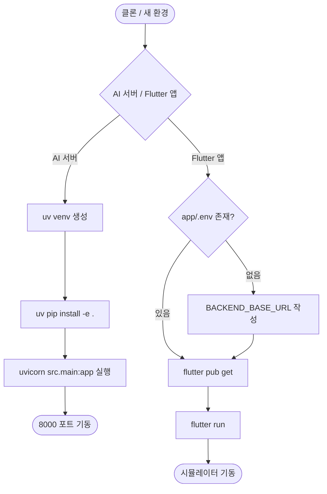

# passQL 로컬 실행 환경 셋업 (AI 서버 · Flutter 앱)

## 개요

passQL 모노레포를 로컬에서 실행하기 위한 환경 셋업을 정리한다. AI 서버(FastAPI)와 Flutter 앱은 클론 직후 바로 실행되지 않는다 — `.venv`와 `app/.env`가 `.gitignore`로 저장소에 포함되지 않아 직접 생성해야 하기 때문이다. 두 스택의 최초 1회 init 절차와 매 실행 명령을 확정했고, Flutter 앱의 백엔드 주소를 prod 기준으로 설정했다.

## 기능 흐름



## 변경 사항

### AI 서버 (FastAPI)
- 실행 디렉토리 확정: `ai/` (작업 디렉토리가 `ai`여야 `src.main:app` 해석됨). `ai.` 접두사를 붙이면 `ModuleNotFoundError: No module named 'src'`/`'ai'` 발생.
- 패키지 관리 방식 확인: `pyproject.toml` 기반 `uv` (배포 `Dockerfile`도 `uv pip install` 사용).
- Swagger 경로 확인: 기본 `/docs`가 아니라 커스텀 `/docs/swagger`. 헬스체크는 `/health`.

### Flutter 앱
- `app/.env` 신규 생성 (gitignore 대상 — 저장소 미포함). pubspec.yaml이 `.env`를 asset으로 요구하므로 파일이 없으면 `No file or variants found for asset: .env` 빌드 실패.
- `.env`의 `BACKEND_BASE_URL`을 prod 백엔드 기준으로 설정하고 로컬 전환용 주석 라인 병기.
- 백엔드 주소 검증 완료: `GET /api/meta/topics → 200` 으로 prod API 응답 확인.

## 주요 구현 내용

### AI 서버 실행

최초 1회 (venv 생성 + 의존성 설치):
```bash
cd ai
uv venv
uv pip install -e .
```

매 실행 (반드시 `ai` 폴더 안에서):
```bash
.venv/bin/uvicorn src.main:app --reload
```
- 접속: http://127.0.0.1:8000/docs/swagger
- 종료: Ctrl + C

### Flutter 앱 실행

최초 1회 (`.env` 생성):
```bash
cd app
cat > .env << 'EOF'
BACKEND_BASE_URL=https://api.passql.suhsaechan.kr/api
EOF
```

환경별 전환 (`.env` 내부, 한 줄만 활성화):
```
# prod (운영) — 기본
BACKEND_BASE_URL=https://api.passql.suhsaechan.kr/api
# local (로컬 Spring 8080)
# BACKEND_BASE_URL=http://localhost:8080/api
```

패키지 설치 + 실행:
```bash
flutter pub get   # 최초 1회 또는 pubspec 변경 시
flutter run       # 시뮬레이터 켜져 있으면 자동 선택
```
- 디바이스 지정: `flutter run -d ios`
- 핫리로드 `r` / 핫리스타트 `R` / 종료 `q`

### baseUrl 경로 규칙

Retrofit 인터페이스 경로가 `/api` 없이 시작(`@POST('/ai/explain-error')`, `@GET('/progress')`)하므로 `BACKEND_BASE_URL`에 `/api`까지 포함해야 한다. 누락 시 모든 요청이 404로 빠진다.

## 주의사항

- `.venv`, `app/.env`는 `.gitignore` 대상이라 새 머신·worktree마다 재생성이 필요하다. 본 문서의 init 절차를 따른다.
- iOS 시뮬레이터는 Mac과 네트워크를 공유하므로 로컬 백엔드는 `localhost:8080`으로 접속 가능하다. 안드로이드 에뮬레이터를 쓸 경우 `10.0.2.2:8080`으로 바꿔야 한다.
- AI 서버 `.venv`는 Python 3.14로 생성되어 있다. 최신 버전이라 일부 네이티브 의존성에서 설치 이슈가 날 수 있으며, 문제 발생 시 3.13으로 재생성을 고려한다 (`pyproject.toml`은 `>=3.13` 요구).
- prod API는 대부분의 엔드포인트가 인증을 요구한다(앱 시작 시 `POST /api/members/register → 401` 관찰됨). 이는 앱 코드가 아닌 서버 인증 정책에 따른 동작으로, 별도 확인이 필요하다.
- IDE(IntelliJ) 실행 구성은 SDK 인식 문제로 사용하지 않고 터미널 실행으로 확정했다.
